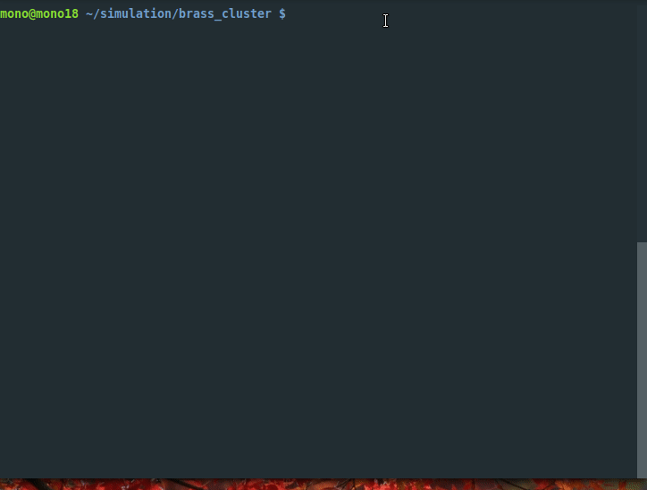
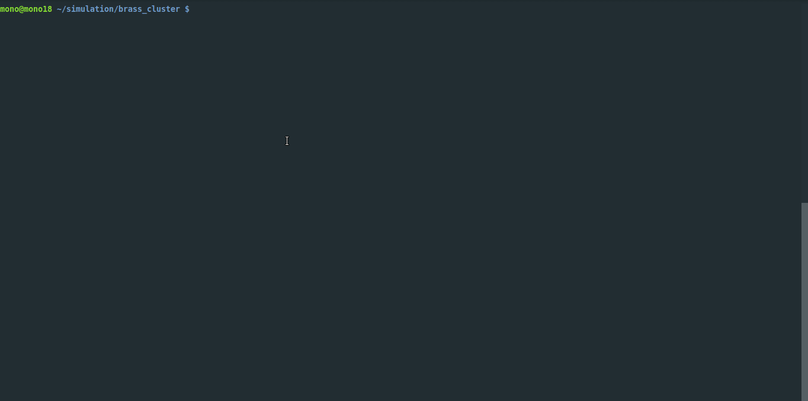

# lindemann

<div align="center">

[](https://github.com/N720720/lindemann/actions?query=workflow%3Abuild)
[](https://pypi.org/project/lindemann/)
[](https://github.com/N720720/lindemann/pulls?utf8=%E2%9C%93&q=is%3Apr%20author%3Aapp%2Fdependabot)

[](https://github.com/psf/black)
[](https://github.com/PyCQA/bandit)  
[](https://github.com/N720720/lindemann/blob/master/.pre-commit-config.yaml)
[](https://github.com/N720720/lindemann/releases)
[](https://pypi/l/lindemann/)


lindemann is a python package to calculate the Lindemann index  of a lammps trajectory as well as the progression of the Lindemann index per frame of temperature ramps  for phase transition analysis.
</div>

## Installation

It requires python 3.7

```bash
pip install lindemann
```

or install with `Poetry`

```bash
poetry add lindemann
```

## Usage

```console
$ lindemann [OPTIONS] TRJFILE
```
or if installed with `Poetry`:

```bash
poetry run [OPTIONS] TRJFILE
```
**Precautions**

Make sure you have enough memory available before you run any flags despite the -t flag. You can check the memory use by using the `-m` or the `--mem_use` Option. The high memory use will be fixed as soon as the numpy.nanmean() function with axis is available for numba.

**Options**:

* `-t`: Calculates the Lindemann-Index for the Trajectory file
* `-f`: Calculates the Lindemann-Index for each frame.
* `-a`: Calculates the Lindemann-Index for each atom for each frame.
* `-p`: Returns a plot Lindemann-Index vs. Frame.
* `-l`: Saves the individual Lindemann-Index of each Atom in a lammpstrj, so it can be viewed in Ovito.
* `-v, --version`: Prints the version of the lindemann package.
* `-ti, -timeit`: Uses timeit module to show running time
* `-m, --mem_use`: Calculates the memory use. Run it before you use any of the cli functionality despite the -t flag
* `--help`: Show this message and exit.

## Demo

Basic usage to calculate the Lindemann Index:


The package has a plotting feature. It will show the a plot Lindemann index vs. the frames. If the trajectory file is a temperature ramp, it is possible to determine the phasetransition.



Usage of the of the lammpstrj file output feature to save the progression for each atom per frame into a lammps trajectory file. Afterwards the trajectory can be viewed with ovito for example, here the lindemann progression was used for the ovito color coding feature.


## Motivation

In my research I have investigated simulated annealing of brass nanoparticles. I had to determine the melting point of many different cluster sizes and zinc compositions. For this purpose I have chosen the Lindemann index. Because of the amount of calculations I wanted a cli tool that could be easily used with mpi. Furthermore, the calculation costs were decisive for me. At the same time i wanted to get to know numba better and so i combined both in this project. numba does not really like pythonic code and can handle verbose code better.

[`ybyygu`](https://github.com/ybyygu/lindemann-index) had already worked out a nice solution in cython with the Welford algorithm, which was found to be easy to convert into numba. [`whashi44`](https://github.com/whashi44/lindemann) in turn had presented a great Numpy version with a GUI, his version convinced me to use ovito for read write tasks of lammps trajectories.

For the determination of the melting point of nanoparticles you can often find plots in the literature which follow the following scheme. A temperature range is defined where the phase transition is likely to take place. Then step lengths for the temperature are defined and then a trajectory is calculated for the respective temperature. If a phase transition occurs, this can be recognized by a jump of the lindemann index. As shown in figure 1


*Figure 1.* 

By working with the Lindemann index and the Welford algorithm  I realized that the development of the lindemann index can be observed across the trajectory. The Welford algorithm allows a live calculation of the mean std, which means that the development of the lindemann index can be observed with the simulation steps. Since I worked with heat ramps for simulated annaeling, I was interested in the development of the lindemann index across the frames of these trajectories. \
This could be realized by a modification of the Welford algorithm . With this method you can observe the change of the lindemann index per frame. Here, too, a characteristic change of the lindemann index occurs, with which the phase transition can also be determined.  The development of the lindemann index over the frames can then be visualized as a plot for the phase transition determination.  If the temperature of the lammps is plotted against the lindemann index, the temperature can also be read directly for the phase transition, as seen in figure 2. 


*Figure 2: Note the noise of the temperature was smoothed with help of [numpy.convolve](https://numpy.org/doc/stable/reference/generated/numpy.convolve.html) with a box size of 40.* 

With a further modification of the Welford algorithm you can also see the contribution of each atom to the lindemann index for each frame. This was especially interesting for me because atomic properties can be easily visualized with tools like OVITO. This gives one a detailed view of the phase transition. This is especially interesting for the investigation of nanoparticles during the phase transition, as they often start melting from the surface. This is where the method in combination with ovito offers a good starting point for further investigations.

Furthermore, computational costs can be reduced by using one heat ramp instead of many trajectories with discrete temperatures. As an example, see fig 1 and 2. In figure 1 16 trajectories with different temperatures were chosen to determine the phase transition. Near the phase transition the step width was reduced for a better determination of the phase transition. Each trajectory has 50k steps, that is 800k in total, whereas in figure 2 the heatramp has only 200k steps. 


## Background

A key problem with the measurement of the melting point of nanoparticles is that with decreasing size of a given nanoparticle the phase transition, defined as the temperature of a sudden change in the enthalpy, becomes less pronounced. This is caused by the surface effect: for a given cluster the surface area is larger compared to a bulk structure of the same size. Melting does not take place all at once, but is a longer melt transition and no longer really a melting point. 

The Lindemann index, stated in the following equation presents a solution for this problem. It describes the root-mean-square (rms) fluctuation of the bonds or interatomic distance in the system over time (or temperature, if the temperature of the system changes as the simulation progresses). The Lindemann index is a more robust method to determine the melting point of nanoparticles, opposed to the enthalpy. Accordingly the Lindemann index is often considered, when the melting point of nano-particles is of interest. The index is defined as, 

<a href="https://www.codecogs.com/eqnedit.php?latex={\langle&space;q_{i}&space;\rangle_{\text{atoms}}={\frac&space;{1}{N(N-1)}}\sum&space;_{j\neq&space;i}{\frac&space;{\sqrt&space;{\langle&space;r_{ij}^{2}\rangle&space;-\langle&space;r_{ij}\rangle&space;^{2}}}{\langle&space;r_{ij}\rangle&space;}}}&space;~." target="_blank"></a>

where <a href="https://www.codecogs.com/eqnedit.php?latex=\inline&space;\fn_phv&space;\large&space;N" target="_blank"></a> is the number of atoms in the nano particle. <a href="https://www.codecogs.com/eqnedit.php?latex=\inline&space;\fn_phv&space;\large&space;r_{ij}" target="_blank"></a> is the distance between atom i and atom j. The brackets <a href="https://www.codecogs.com/eqnedit.php?latex=\inline&space;\fn_phv&space;\large&space;\langle~\rangle" target="_blank"></a> representing a time or temperature average. The rms of the bond fluctuation is considerable lower for a solid than for a liquid, due to restrained degrees of freedom. In a solid, the atoms hold on to their position and only fluctuate around their equilibrium positions. During the melting process the atoms become more mobile and are able to leave their original position. The translation movement of atoms is magnitudes larger than that of the bond fluctuations of a solid. As a result, the Lindemann index rises dramatically at the melting point and therefore gives a suitable observable to determine the transition phase. In effect, the Lindemann index measures a sort of average difussion coefficient for the atoms in the system.

A key problem with much of the literature regarding the Lindemann index, is that there is a uncertainty of where to define the phase transition within a Lindemann plot. On the grounds that the melting point is a macroscopic definition for bulk structures. But here nanoparticles differ: because of their relative small size, compared to bulk structures, melting can occur fist on their relative large surface, compared to the volume they obtain and followed by the melting of core of the particle. Therefore a temperature range, rather then a melting point, is observed, as stated by Neyts in their work.    

## 🛡 License

[](https://pypi/l/lindemann/)

This project is licensed under the terms of the `GPLv3` license. See [LICENSE](https://github.com/N720720/lindemann/blob/master/LICENSE) for more details.

## 📃 Citation

```
@misc{lindemann,
  author = {Sebastian Thurm},
  title = {lindemann is a python package to calculate the Lindemann index  of a lammps trajectory as well as the progression of the Lindemann index per frame of temperature ramps  for phase transition analysis.},
  year = {2020},
  publisher = {GitHub},
  journal = {GitHub repository},
  howpublished = {\url{https://github.com/N720720/lindemann}}
}
```

## Credits

The Lindemann index is introduced in the following paper,\
F. A. Lindemann, *Zeitschrift für Phys.* **1910**, *11*, 609–612.\
This package is based on the work from [`ybyygu`](https://github.com/ybyygu/lindemann-index)
and [`whashi44`](https://github.com/whashi44/lindemann) on calculating the Lindemann index.\
The visualisations in this Readme are made with [`Ovito`](https://www.ovito.org/).\
A. Stukowski, *Model. Simul. Mater. Sci. Eng.* **2010**, *18*, 15012. [`link`](https://iopscience.iop.org/article/10.1088/0965-0393/18/1/015012).\
This project was generated with [`python-package-template`](https://github.com/TezRomacH/python-package-template).\
The Welford Algorith can be found in:\
Donald E. Knuth ,*The art of computer programming*, volume 2 (3rd ed.): seminumerical algorithms, Addison-Wesley Longman Publishing Co, **1997**, 232.
